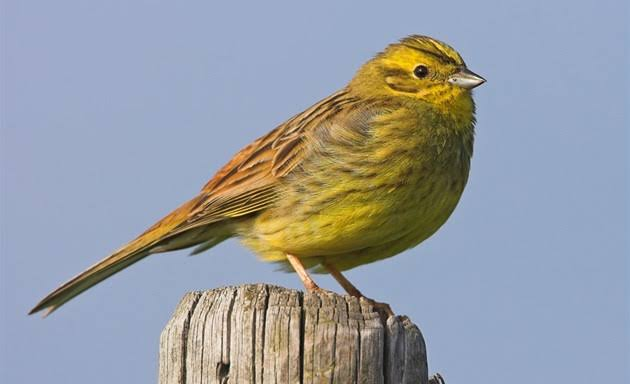
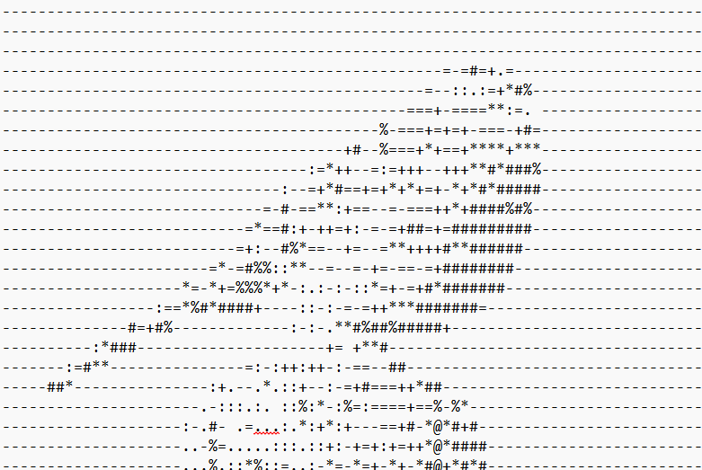

# ASCII Art

Scala project that converts images into ASCII art using a command-line interface.


*Yellowhammer*

<picture>
  <source media="(prefers-color-scheme: dark)" srcset="images/yellowhammer-ascii-dark.png">
  <source media="(prefers-color-scheme: light)" srcset="images/yellowhammer-ascii-light.png">
  
</picture>

*Yellowhammer in ASCII art*

## Overview

This project was created as a semester assignment focused on object-oriented programming. It loads an image, applies transformations, converts it to grayscale, and renders the result as ASCII text.

## Features

- load an image from a file or generate a random image
- convert RGB images to grayscale and grayscale values to ASCII characters
- apply brightness, invert, flip, rotate, scale, and font aspect-ratio filters
- choose between predefined ASCII conversion tables or provide a custom table
- export the result to the console, a file, or both
- validate command-line arguments and report invalid combinations clearly

## Processing pipeline

The application is organized into separate stages:

1. Load an RGB image from a supported file format or generate one randomly.
2. Apply RGB filters such as rotation, scaling, flipping, and font aspect-ratio correction.
3. Convert the processed image to grayscale.
4. Apply grayscale filters such as brightness and inversion.
5. Convert grayscale values to ASCII using the selected character table.
6. Export the generated text to the requested destinations.

This separation makes the behavior of each transformation easier to reason about and test.

## Command-line options

The application takes no positional arguments – everything is a flag. Unknown flags and
flags with a missing value are rejected with an error message.

### Image source (required, exactly one)

| Option | Description |
| --- | --- |
| `--image <path>` | Load an image from a file. Supported formats: `jpg`, `jpeg`, `png`, `gif`, `bmp`. |
| `--image-random` | Generate a random image instead of loading one. |

Specifying both or the same source twice is an error.

### Output (required, at least one)

| Option | Description |
| --- | --- |
| `--output-console` | Print the ASCII art to standard output. |
| `--output-file <path>` | Write the ASCII art to the given file. |

Both may be used together to write to the console and to a file in one run.
`--output-file` may only be given once.

### Conversion table (optional, at most one)

Controls which characters represent which brightness levels. Defaults to `bourke`.

| Option | Description |
| --- | --- |
| `--table <name>` | Use a predefined table: `bourke`, `standard`, or `high-contrast`. |
| `--custom-table <chars>` | Use a custom character ramp, ordered from darkest to lightest, e.g. `".:-=+*#%@"`. |

An unknown table name or an empty custom ramp prints a warning and falls back to the default
rather than failing.

### Filters (optional, repeatable)

| Option | Description |
| --- | --- |
| `--rotate <degrees>` | Rotate the image. Must be a multiple of 90 (`90`, `+180`, `-90`). |
| `--scale <factor>` | Resize the image. Only `0.25` (half the width and height), `1` (unchanged) and `4` (double the width and height) are supported. |
| `--flip <x\|y>` | Flip the image along the `x` or `y` axis. |
| `--font-aspect-ratio <x:y>` | Resample the image height to compensate for non-square font cells, e.g. `1:2` for a font twice as tall as it is wide. |
| `--brightness <value>` | Shift every pixel by the given amount, in the range `-255` to `+255`. Results are clamped to `0`–`255`. |
| `--invert` | Invert the grayscale values. |

## Examples

```bash
# console output
sbt "run --image ./src/test/resources/BlackAndWhite.png --output-console"

# save to a file, no console output
sbt "run --image ./src/test/resources/BlackAndWhite.png --output-file output.txt"

# rotate, brighten and invert, then write to both console and file
sbt "run --image ./src/test/resources/BlackAndWhite.png --rotate 90 --brightness 20 --invert --output-console --output-file output.txt"

# random image with a custom character ramp
sbt "run --image-random --custom-table '.:-=+*#%@' --output-console"

# compensate for a font that is twice as tall as it is wide
sbt "run --image ./src/test/resources/BlackAndWhite.png --font-aspect-ratio 1:2 --output-console"
```

### Yellowhammer example

If you would like to get the same result of Yellowhammer as I displayed, you can use the following command:

```bash
sbt "run --image ./images/yellowhammer.jpg --output-console --output-file ./images/yellowhammer-ascii --font-aspect-ratio 1:2 --scale 0.25 --scale 0.25 --scale 0.25"
```
